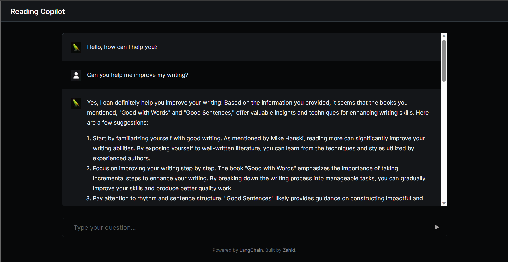

## Reading Copilot Power By Azure
### Microsoft Learn AI Skills Challenge Project

### [Live Demo](https://wonderful-sea-0b60a9b00.3.azurestaticapps.net/)

Reading Copilot is an innovative and powerful tool designed to enhance your reading experience and knowledge acquisition. It combines cutting-edge technologies, including natural language processing and artificial intelligence, to provide users with an intelligent reading companion.

### What Azure services we use
+ __Azure OpenAI Service__
+ __Azure Static Web App__
+ __Azure VM__
### Team Members:
+ Yuxuan.Zhang
    + Year 2, Xi'an Jiaotong-Liverpool University
    + Github: [@zR](https://github.com/zRzRzRzRzRzRzR), 
+ Wenwei.Lin
    + Year 4, Jiangsu University of Technology
    + Github: [@Wenwei Lin](https://github.com/wenwei-lin)

### Project Overview
The inference end of this project is based on the open-source framework [Langchain-ChatChat](https://github.com/chatchat-space/Langchain-Chatchat) with the following improvements:
+ Utilizes __Azure OpenAI Service__ Service, Including Embedding and __Azure OpenAI Service__  Chat models for question-answering.
+ Adds Langchain's summarization feature, allowing for embedding more related knowledge repositories at once and summarizing before answering, significantly improving accuracy.
+ Utilizes vector caching to reduce the cost of repetitive embeddings.

The frontend of this project is based on the open-source project [LangChain Chat - Next.js](https://github.com/zahidkhawaja/langchain-chat-nextjs) with the following enhancements:
+ Connects to a custom inference end.
+ Displays indexes of relevant documents in robot responses.

### Knowledge Repository Contents
Currently, the demo contains two books and our reading notes:
+ Good with Words.pdf
+ Six Walks in the Fictional Woods.txt
+ Bits of Note.csv

We've named this knowledge repository "Books," and users can input questions to obtain corresponding answers.

### Demo Access
+ We've deployed the demo on Azure Static Web App, and you can access it [here](https://wonderful-sea-0b60a9b00.3.azurestaticapps.net/).
+ Please note that this demo is for showcase purposes only and has low capacity. If you require a better experience, we recommend deploying it on your own.

### Future Work
+ Add a book uploading feature to the frontend. Currently, the framework supports real-time file uploads and updates, but due to limitations with the __Azure OpenAI Service__ Embed model, uploading models may cause frontend delays. Currently, only backend file uploads and vectorization are supported. We plan to address this issue in the future.
+ Support online PDF reading and highlight embedded results.
