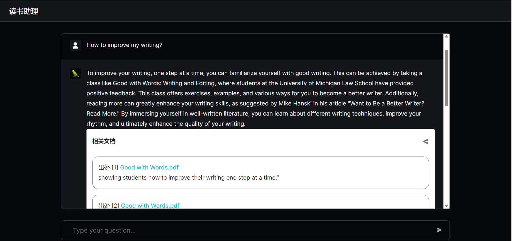

## Microsoft Learn AI 技能挑战赛
### 项目名称 : 基于LangChain 和 Azure OpenaAI的读书知识问答DEMO
### 参赛人员： zR,

### 项目简介
本项目的推理端基于开源框架[Langchain-ChatChat](https://github.com/chatchat-space/Langchain-Chatchat)，并做出了如下的改进
+ 使用Azure OpenAI Embed和Azure OpenAI Chat模型进行问答。
+ 添加了Langchian的总结功能，允许一次Embed更多相关知识库，并进行总结后再次回答，大大提升准确率。
+ 使用向量缓存，减少重复Embed的损失。

本项目的前端基于开源项目[LangChain Chat - Next.js](https://github.com/zahidkhawaja/langchain-chat-nextjs)，并做出如下改进：
+ 连接自定义的推理端
+ 在机器人回复中显示相关文档的索引

### 前端项目部署

1. 克隆此仓库
2. 安装依赖: `npm install` （需要 Node.js >= 16）
3. 修改 `.env` 中的环境变量 `LCC_ENDPOINT_URL` 为自定义的推理端地址
4. 运行: `npm run dev`

### 知识库内容
当前，demo中的已经存放了两本书籍以及我们的一份阅读笔记。
+ Good with Words.pdf
+ 悠游小说林-_（意）安贝托·艾柯_-_z-lib.org_.txt
+ Bits of Note.csv

我们将其命名为Books的知识库，用户可以通过输入问题，获取到对应的答案。

### Demo访问地址
+ 我们已经将Demo 部署到了Azure Web App上，可以通过[这里](https://wonderful-sea-0b60a9b00.3.azurestaticapps.net/)访问我们的demo。
+ 该Demo仅限展示使用，承载量很低。如果需要更好的体验，请自行部署。

### 后续工作
+ 在前端增加图书上传功能。目前，该框架已经支持及时的文件上传和更新，但是由于Azure OpenAI Embed模型的限制，上传模型可能导致前端网页延迟，目前仅支持后端上传文件并向量化。我们将在未来修复这个问题。
+ 支持PDF在线阅读和高亮Embed结果。